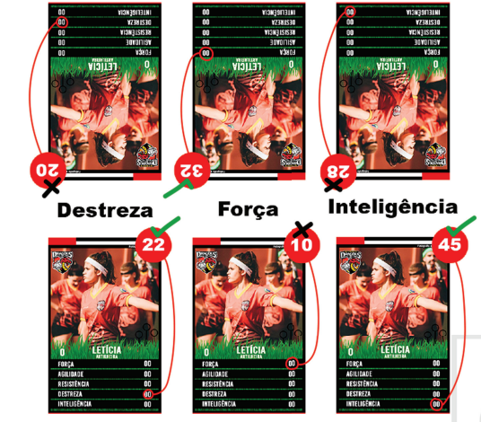

<meta charset="utf-8">
<h1>Paulistão Battle Cards Online</h1>
Site do jogo Paulistão Battle Cards, você pode ver ele <a href="https://bsad79.github.io/PBC/">aqui</a>

<h1>Regras</h1>

As regras do Paulistão Battle Cards foram baseadas no jogo Super Trunfo Battle Cards, o jogo consiste em você 
conhecer os atributos de cada uma de suas cartas e posiciona-las corretamente para derrotar seu oponente.
 Para jogar você precisa de um Deck, ou seja, um conjunto de no mínimo 12 e no máximo 15 cartas escolhidas 
por você, e claro, um adversário. O uso de cartas raras, ou seja, cartas simbolizadas com “Jogada Fantástica” 
é limitado a no máximo 2 cartas por Deck, sendo que cada jogador, poderá utilizar apenas 1 delas durante uma 
partida. Só pode ser adicionado ao Deck no máximo 2 cartas que contenham um único atributo com valor de 40 
ou mais pontos. Não é permito o uso de cartas iguais no mesmo Deck, todas as cartas devem ser diferentes.
 Os Decks são embaralhados e colocados à frente dos jogadores, virados para baixo. Cada jogador 
compra 4 cartas, escolha 3 e descarte uma delas, então joga-se o dado 3 vezes (ou 3 três dados) 
para determinar quais atributos serão utilizados naquele turno. Caso um dado caia com o símbolo 
“?” virado para cima, ou um símbolo de um atributo repetido, jogue-o novamente. Feito isso, é preciso 
escolher o maior valor de cada carta e posiciona-las nas respectivas categorias, o adversário deve 
fazer o mesmo, todas voltadas para baixo. Assim que ambos já tiverem escolhido onde colocar 
cada carta, viram-se as cartas para cima para comparar os valores e veja quem ganhou mais vezes.

No exemplo acima o jogador de baixo teve vantagem em 2 dos 3 atributos escolhidos, logo ele tem a vitória 
do turno ganhando 1 ponto, caso haja um empate cada jogador recebe 1 ponto. Descarte as 3 cartas usadas 
e repita a jogada. Aquele que conseguir 3 pontos primeiro vence o jogo! Caso os jogadores queiram deixar 
o jogo mais interessante, ambos podem apostar alguma carta (ou varias) antes de iniciar a partida.

